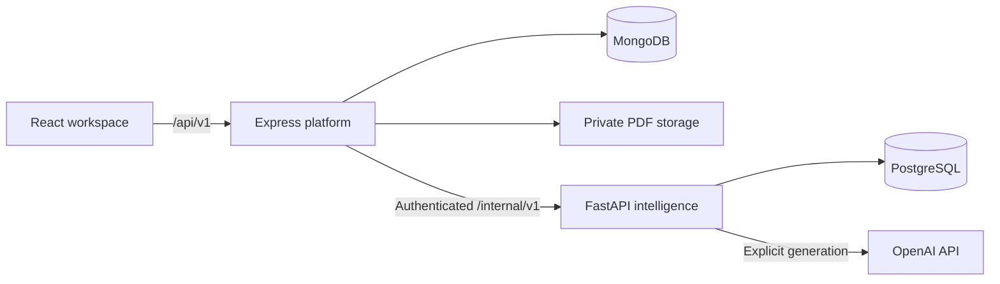

# CareerOS — Your Career Buddy

A personal career workspace to discover jobs, organize resumes, understand your fit, prepare for interviews and keep track of your job search. **Cady** is the built-in AI career assistant: Career + Buddy.

**Status:** Active development. The core platform, initial intelligence features and E0 usability/evidence foundation are implemented. E1 is next; the remaining intelligence expansion and full Phase 2 release verification are pending. Full application workflows and community are later phases. Status reviewed against the repository on **9 October 2026**.

[Setup](#set-up-locally) · [Features](#current-features) · [Product vision](docs/product-vision-and-features.md) · [Architecture](#current-architecture) · [Roadmap](#planned-work) · [Development](#developing-and-checking) · [Documentation](#documentation)

## Set up locally

### 1. Install the prerequisites

| Requirement | What to install |
| --- | --- |
| Git | [Git for your operating system](https://git-scm.com/install/) |
| Node.js and npm | [Node.js 24](https://nodejs.org/en/download) and npm 11, as required by `package.json`; `.nvmrc` selects Node 24 |
| Docker and Compose | [Docker with the Compose plugin](https://docs.docker.com/compose/install/); Docker Desktop includes both on macOS, Windows and Linux |

Start Docker before continuing. The default setup runs the application and databases in Linux containers, so you do not need to install Python, MongoDB or PostgreSQL on your host. The shell examples below use Bash; Windows users can run them with [WSL2 and Docker integration](https://docs.docker.com/desktop/features/wsl/).

Check your tools:

```bash
git --version
node --version
npm --version
docker compose version
docker info
```

### 2. Clone and configure the repository

```bash
git clone https://github.com/Sam23599/CareerOS---Your-Career-Buddy.git
cd CareerOS---Your-Career-Buddy
npm run setup
```

`npm run setup` creates the root `.env` from [`.env.example`](.env.example) and generates separate random values for the JWT signing secret, private intelligence service token and intelligence database password. It preserves existing settings and credentials. This script uses Node's built-in modules, so `npm ci` is not required for the Docker quick start.

Email/password registration works without OAuth credentials. PDF extraction works without an AI key. You can leave the Google, GitHub and OpenAI fields empty initially and configure them later. Keep `.env` private; it is ignored by Git.

### 3. Start the application

```bash
docker compose up --build -d --wait
docker compose ps
```

The first run downloads images, installs dependencies and starts five services: `web`, `api`, `mongodb`, `intelligence` and `intelligence-postgres`. The intelligence service applies its database schema and migrations at startup. Test containers are excluded from ordinary startup.

| Destination | Default address |
| --- | --- |
| CareerOS | [http://localhost:5173](http://localhost:5173) |
| Connection status | [http://localhost:5173/status](http://localhost:5173/status) |
| API liveness | [http://localhost:3000/api/v1/health](http://localhost:3000/api/v1/health) |
| API database readiness | [http://localhost:3000/api/v1/ready](http://localhost:3000/api/v1/ready) |
| MongoDB | `mongodb://127.0.0.1:27017/careeros` |

Python and PostgreSQL have no published host ports in the default stack. The browser accesses backend features through Express at `/api/v1`; Python is an internal service.

### 4. Try the core workflow

1. Open CareerOS and register your own account.
2. Build your career profile and preferences at `/profile` → **Edit profile**.
3. Upload a PDF at `/resumes`. Preview it on the page or use **Extract text** to inspect how it was read.
4. Explore `/jobs`, save opportunities and organize them at `/saved-jobs`.
5. Add a supported company feed or a career-page bookmark at `/career-sources` and set notification preferences at `/notifications`.
6. Configure OpenAI below to generate resume/job analyses, create a preparation roadmap and chat with Cady.

Remotive jobs are fetched from its current public feed when a refresh is due, then served from CareerOS's database. CareerOS checks at startup and every four hours while the API is running; [Remotive delays listings in its public feed by 24 hours](https://github.com/remotive-com/remote-jobs-api). Internet access and provider availability affect imports. To request a manual import:

```bash
docker compose exec -T api npm run jobs:ingest -- remotive
```

Manual imports share the stored cooldown with scheduled refreshes. For explicitly labelled demo jobs, use `fixture` instead of `remotive`. See [job ingestion](docs/api/jobs.md).

### 5. Optional: enable Google or GitHub sign-in

Create a provider application and set its matching client ID/secret pair in the root `.env`:

```dotenv
OAUTH_PUBLIC_ORIGIN=http://localhost:5173
GITHUB_CLIENT_ID=your-client-id
GITHUB_CLIENT_SECRET=your-client-secret
# Configure these only if enabling Google as well:
GOOGLE_CLIENT_ID=
GOOGLE_CLIENT_SECRET=
```

| Provider | Application setup | Callback URL |
| --- | --- | --- |
| GitHub | OAuth App; homepage `http://localhost:5173` | `http://localhost:5173/api/v1/auth/oauth/github/callback` |
| Google | Web application OAuth client; configure consent/test users | `http://localhost:5173/api/v1/auth/oauth/google/callback` |

Configure either provider independently; leave unused pairs empty. Recreate the API to load the settings:

```bash
docker compose up -d --force-recreate api
```

Use the same host and port consistently for login, `OAUTH_PUBLIC_ORIGIN` and the provider callback. If you change the frontend origin, update the allowed origins and provider application too. Unconfigured providers appear disabled with an explanation. GitHub's live account flow has been verified locally; Google is implemented but live verification remains deferred. See the [authentication and OAuth guide](docs/api/authentication.md#google-and-github-setup).

### 6. Optional: enable AI generation

Add your provider key to the root `.env`:

```dotenv
OPENAI_API_KEY=your-openai-api-key
LLM_MODEL=gpt-6-luna
LLM_REASONING_EFFORT=medium
```

```bash
docker compose up -d --force-recreate intelligence
```

OpenAI is the current provider. The repository's model registry lists `gpt-4.1`, `gpt-6-luna` and `gpt-6.1-sol`, with model-specific reasoning choices. These are configured model IDs; actual access depends on the provider account. Future Gemini/Grok adapters are planned.

Explicit resume analysis, job analysis, preparation generation and Cady questions send the relevant text/context to OpenAI and may incur provider charges. The API key stays in the intelligence service; never put it in a `VITE_*` variable. Opening saved analyses, matching, resume checks and saved-job ranking make no new AI call. The **AI usage and credits** settings panel currently displays demo figures, not measured account usage or a working payment balance.

See [resume draft configuration](docs/resume-drafts.md) and [preparation/Cady inputs and limits](docs/personalized-preparation.md). Removing the key and recreating intelligence disables new generation while retained analyses remain readable.

### Stop, restart and keep your data

```bash
docker compose logs -f api web intelligence
```

Press **Ctrl+C** to leave the log stream. Stop or start the stack with:

```bash
docker compose down
docker compose up -d --wait
```

Ordinary container recreation and `docker compose down` preserve the named volumes:

| Data | Owner and storage | Default Docker volume |
| --- | --- | --- |
| Accounts, password hashes, sessions, profiles, jobs, saved jobs, career sources and notifications | Express / MongoDB | `careeros_mongodb_data` |
| Original uploaded PDF bytes | Express / private file storage at `/data/resumes` | `careeros_resume_data` |
| Derived CV/JD analyses, preparation plans, tasks and the current saved Cady conversation | Python / PostgreSQL | `careeros_intelligence_db_data` |

**`docker compose down -v` deletes these volumes, including uploaded resumes and stored account data.** Keep the volumes and `.env` when retaining a local installation. Resume removal through the app follows the recovery policy described below; deleting Docker volumes bypasses it.

This Compose stack is for local development. The production deployment and hardening work belongs to a later phase.

### Common setup problems

| Symptom | What to check |
| --- | --- |
| Docker connection error | Start the Docker engine; confirm `docker info` works. |
| A port is already in use | Change `WEB_PORT`, `API_PORT` or `MONGO_PORT` in `.env`, then recreate the affected services. For host development, also align `MONGODB_URI` with `MONGO_PORT`. |
| Missing secret or database-password error | Run `npm run setup` from the repository root. |
| Provider button is disabled | Supply both its client ID and secret, then recreate `api`. |
| OAuth returns an error | Check the exact callback/origin, start a fresh login and inspect `docker compose logs --since 5m api`; see the authentication guide. |
| New analysis is unavailable | Check the OpenAI key/model configuration and intelligence/PostgreSQL logs. Core API readiness does not prove AI availability. |
| PDF extraction fails on host Python | Keep the parser in Linux Docker; its enforced memory limits deliberately require Linux. |
| Jobs are missing from a company source | Check source coverage, saved/temporary filters and its last refresh result. Bookmarks do not import jobs; Google coverage is limited. |

For more detail, see [local development](docs/local-development.md) and [intelligence setup](docs/intelligence-development.md).

## What is CareerOS?

CareerOS brings the job-search journey into one workspace:

```text
Discover → Understand your fit → Prepare → Save and track progress
                                  ↕
                                 Cady
```

The product aims to connect career profiles, resumes, job discovery, evidence-based assessments, preparation, applications and eventually collaboration. It is built incrementally so that each stage delivers a usable workflow before introducing more infrastructure.

For the detailed feature-by-feature vision, examples and long-term architecture direction from the previous README, see the [product vision and feature guide](docs/product-vision-and-features.md).

## Current features

### Core platform

| Feature | Available today |
| --- | --- |
| Identity and sessions | Email/password registration, email or optional username login, JWT access/refresh sessions, automatic session restoration, remembered-account card, USER/ADMIN foundation and optional Google/GitHub OAuth. OAuth accounts can add an optional CareerOS password. |
| Career profile | Separate view/edit pages for skills, experience, education, certifications, links and career preferences, with revision checks for conflicting edits. |
| Resume library | Private PDF uploads up to 5 MiB, immutable upload versions, active-resume selection, in-page PDF preview, download, extracted-text preview and recovery after removal. OCR and DOCX support are future work. |
| Job discovery | Live Remotive ingestion, normalized public listings, search, filters, sorting, pagination, original-source links and stale/expired listing handling. |
| Company career sources | Greenhouse feeds, limited Google Careers imports, manual or 4/12/24-hour checks, optional temporary check filters, reset/update-saved-filter controls and New/Earlier groups based on the previous source visit. |
| Career bookmarks | Separate saved links for unsupported company pages, with an explicit option to enable job tracking when native support is available. |
| Saved jobs | Private notes, priority, interest state, manual application progress/history, search/filtering and recoverable removal. Full application/interview workflows are planned for Phase 3. |
| Notifications | In-app matching-job/source-failure alerts, unread/read states and notification preferences. |
| Workspace and recovery | Responsive navigation, Light/Dark/System appearance, guarded dialog dismissal and a recycle bin for resumes, saved jobs and sources/bookmarks. Default user recovery is 30 days; later retained data is recoverable only through support. |

**Source coverage matters:** Greenhouse supports complete board refreshes. Google imports only the first 20 unfiltered public results per check and does not provide complete-site coverage. Bookmarks save links without fetching jobs. Native LinkedIn, Naukri, Indeed, recruiter/contact enrichment and employer-review imports are planned, rather than existing connectors. See [career-source behavior](docs/api/career-sources.md).

### Intelligence and preparation

| Feature | How to use it | Current behavior |
| --- | --- | --- |
| Structured resume drafts | `/resumes` → **Resume draft** → **Analyze resume** | Generate detailed fields with source evidence, retain numbered analyses, review/edit selected fields and explicitly confirm profile import. |
| Job-description analysis | Job detail → **Job analysis** → **Analysis versions & settings** | Generate private numbered analyses of requirements, priorities and responsibilities, with quoted evidence and stale/expired notices. Settings and selected-version details start collapsed. |
| CV-to-job review | Job detail → choose **Resumes** and **Resume analysis** → **Review fit & gaps** | Combine weighted skill coverage, matched/missing evidence, requirements needing review and resume findings from saved analyses. |
| Resume checks | `/resumes` → **Check resume** | Inspect recognized sections, PDF-reading warnings, literal job terminology and evidence gaps in compact expandable reports. |
| Saved-job ranking | `/saved-jobs` → **Rank your shortlist** | Rank up to 50 filtered saved jobs using skill coverage, explicit preferences and priority, with reasons and separate unavailable/unanalysed results. |
| Personalized preparation | Job detail → **Create AI preparation plan** after selecting comparison inputs | Confirm learning versus evidence gaps, choose a 1–8-week/time budget, generate a versioned roadmap and review/save session progress. Week browsing is separate from **Continue preparation**, which focuses the first unfinished session. |
| Task history | `/tasks` | Follow accepted job-analysis/preparation tasks after navigation, inspect status/failures and cancel queued work. Resume AI generation still runs inline; its queue migration is planned. |

Matching, checks and ranking use existing analyses without a new provider call. The current matching score measures explainable skill coverage; it is not a hiring probability or an employer's ATS score. Other experience/role requirements remain explicitly reviewable. Generated content and source quotations still need user review.

### Cady today

Open `/cady` or the **Ask Cady** widget on an authenticated workspace page. Choose one saved CV analysis, optionally up to three job analyses and self-reported profile skills. Cady answers explicit questions, shows expandable source references and shares the conversation between its page and widget.

The current account conversation retains the last ten question-and-answer pairs across refreshes/restarts; the last six messages provide prompt continuity. Changing context/model or choosing **New conversation** resets this bounded history. Full retained threads and shared account memory are planned in E1. Context starts collapsed, the widget keeps messages scrollable and **Jump to latest** lets you return after reading older replies.

Cady currently gives advice from selected saved facts. Web research, retrieval across all career history and confirmed app-control actions are planned extensions. See [Cady use and limits](docs/personalized-preparation.md).

### Latest foundation: E0

E0 adds the focused navigation, preparation, chat-scrolling, analysis-label/disclosure and guarded-dismissal improvements above. It also adds reusable Python source/evidence contracts, a generated platform schema and an offline evaluator with 16 synthetic draft cases covering ownership, revisions, removed sources, unsupported claims and other evidence boundaries.

These contracts prepare the later RAG/tool work. Human review and a larger held-out benchmark remain pending before measuring Cady accuracy. See [E0 implementation and recorded verification](docs/intelligence-foundation.md).

## Current architecture

| Layer | Stack | Responsibility |
| --- | --- | --- |
| Web | React, TypeScript, Vite | Workspace UI, account flows, reviews and Cady page/widget |
| Platform | Node.js 24, Express, TypeScript, MongoDB | Authentication, owned profiles/files, public jobs, saved jobs, sources, notifications and frontend API gateway |
| Intelligence | Python 3.14, FastAPI, Pydantic, pypdf/fontTools, PostgreSQL, OpenAI | PDF extraction, derived analyses, matching/checks, preparation, Cady and shared AI infrastructure |
| Local runtime | Docker Compose | Five running services, development reloads and persistent data volumes |



Node resolves the signed-in user's owned sources before forwarding data to Python. Python owns derived records and shares its provider infrastructure across features; Cady is one consumer. Backend domain services and provider/storage adapters use OOP responsibilities. Routes and startup compose those services.

The current background executor uses PostgreSQL task records and an in-process worker. Redis, Celery, vector databases, Kafka and Java/Spring Boot are planned additions. See [system overview](docs/architecture/system-overview.md), [service boundaries](docs/architecture/service-boundaries.md) and [architecture decisions](docs/adr/README.md).

## Planned work

### Intelligence expansion before Phase 2 release closure

The [intelligence expansion plan](docs/intelligence-evolution-plan.md) preserves the original roadmap while organizing the remaining work into implementable batches:

| Batch | Planned scope |
| --- | --- |
| E0 | Initial usability/source/evaluation foundation implemented; human benchmark review remains pending |
| E1 — next | Central account AI preferences, durable threads/messages, shared revisioned context of about 4,000 tokens, sliding conversation/application windows and real per-call/model usage accounting |
| E2 | Shared execution capacity and Celery/Redis; migrate existing job/preparation tasks, then queue resume analysis and later batch work |
| E3 | Separate chunking, indexing, retrieval and generation classes; selectable pgvector/FAISS, optional BM25 hybrid search, cloud/storage factories and Redis warming with database fallback |
| E4 | Cady Read, Write and Agent/action tools, aggregated recommendation context, targeted live-state reads, verified public research, approved action plans and explicitly confirmed writes with execution receipts and post-action checks |
| E5 | Verified learning-resource discovery and recommendations for preparation sessions |
| E6 | Richer role/experience alignment and resume improvement supported by CV/JD evidence |
| E7 | Wider job discovery/recommendations and explainable reranking beyond the saved-job baseline |
| E8 | Curated API/MCP/plugin integrations, signed webhooks and resumable approved workflows; optional LangGraph where required |
| E9 | Cady persona/icon and optional page-aware Smart Cady, with measured usage and bounded calls |

For the planned FAISS backend, **S3 stores index artifacts; actual document content remains in database/Redis**. Graph-memory options are researched for later experimentation. Real AI usage will precede any wallet/payments integration; credit purchase, payments and optional auto-refill need a separate future stage after product-development stages.

After the selected expansion, finalize Phase 2 release verification and record any agreed deferrals, then proceed to Phase 3. Full application/interview tools depend on the future application domain. See the [RAG/storage plan](docs/rag-pipeline-and-storage-plan.md), [Cady tool design](docs/cady-retrieval-and-tools-design.md), [usage/credits plan](docs/ai-usage-and-credits-plan.md) and [graph/browser research](docs/graph-memory-and-browser-tools-research.md).

### Original product roadmap

| Phase | Scope and current position |
| --- | --- |
| 0 — Foundation | Repository, architecture decisions and local development setup established |
| 1 — Core platform | Core job workflow implemented and verified locally; Google live OAuth verification remains deferred |
| 2 — Intelligence | CV/JD analysis, skill review, saved-job ranking, preparation and initial Cady implemented; expansion and release closure remain |
| 3 — Applications | Java/Spring Boot application lifecycle, history, interviews, scheduling, analytics and transactional workflows |
| 4 — Events | Kafka where domain events and asynchronous communication provide value |
| 5 — Community | Teams, invitations, membership roles, job/resource sharing, discussions and real-time collaboration |
| 6 — Notifications and automation | Broader delivery channels, reminders, scheduled preparation/application follow-ups and integrations |
| 7 — Production | AWS deployment, CI/CD, orchestration, observability, scaling and production security |
| 8 — Advanced Cady | Broader career-agent workflows, personalization and appropriately scoped automation |

Multi-source discovery, profile improvement, richer preparation and collaboration remain part of the product vision. Future provider/platform integrations depend on supported access and their own adapters. The authoritative scope is the [development plan](docs/development-plan.md), with current milestones in the [Phase 2 backlog](docs/phase-2-backlog.md).

## Developing and checking

### Run React and Express on your host

Use Node 24/npm 11 on the host while keeping MongoDB, PostgreSQL and the Linux intelligence service in Docker. The inline Compose override below lets Python reach the host API for background-task source checks; changing the root `.env` alone does not override Compose's `http://api:3000` setting.

```bash
npm run setup
npm ci
docker compose stop api web
docker compose -f docker-compose.yml -f docker-compose.intelligence-host.yml -f - up --build -d --wait mongodb intelligence <<'YAML'
services:
  intelligence:
    environment:
      INTELLIGENCE_PLATFORM_URL: http://host.docker.internal:${API_PORT:-3000}
    extra_hosts:
      - "host.docker.internal:host-gateway"
YAML
API_HOST=0.0.0.0 npm run dev
```

The override publishes intelligence on `127.0.0.1:8000` and uses Docker's [host gateway](https://docs.docker.com/reference/cli/docker/container/run/#add-entries-to-container-hosts-file---add-host) for the return connection. `API_HOST=0.0.0.0` lets the container reach Express. The root `.env` should use `INTELLIGENCE_SERVICE_URL=http://127.0.0.1:8000` and the correct host `MONGODB_URI`. The Vite proxy reads the same root configuration. Host resume files default to `backend/platform/data/resumes/`, configurable through `RESUME_STORAGE_DIR`.

Web/API source edits reload automatically in either mode. Rebuild intelligence after Python changes with `docker compose up -d --build intelligence` for the default stack; repeat the Compose command with its inline override when using host mode. Recreate affected containers after environment changes and rebuild after dependency/configuration changes. To return to the full Docker stack, stop `npm run dev` and run `docker compose up --build -d --wait`.

### Available checks

Install host dependencies with `npm ci` before Node or browser checks:

```bash
npm run lint
npm run typecheck
npm test
npm run build
npm run test:intelligence
```

`npm run test:intelligence` builds an isolated Linux test image and runs Python tests with temporary test storage. PostgreSQL integration checks require explicit test-database configuration; see [intelligence verification](docs/resume-drafts.md#checks). AI generation is mocked in automated checks.

Install [Playwright's browser dependencies](https://playwright.dev/docs/intro) before browser checks:

```bash
npx playwright install --with-deps chromium
npm run test:components
npm run test:e2e
```

Component checks start their own gallery on port 5183 and use mocked requests. End-to-end checks expect the local app on port 5173 unless `E2E_BASE_URL` is set; flows with real API calls create test accounts/data. MongoDB integration checks and detailed verification commands are documented in [local development](docs/local-development.md#checks).

Pydantic is the intelligence schema source of truth; [the schema export script](scripts/export-draft-schema.py) generates the platform JSON schemas. The [offline evaluator](scripts/evaluate-cady.py) validates synthetic case definitions or reviewed observations without calling a model. Its setup, limits and historical E0 check results are documented in [the foundation guide](docs/intelligence-foundation.md).

### Repository layout

```text
CareerOS---Your-Career-Buddy/
├── frontend/web/                 # React application and browser/component checks
├── backend/
│   ├── platform/                 # Express domains, gateway and MongoDB access
│   └── intelligence/             # Modular FastAPI domains, providers and PostgreSQL
├── docs/                         # Product plans, API contracts, guides and ADRs
├── design-system/careeros/        # Shared design reference
├── scripts/                      # Environment setup, schema export and evaluation
├── docker-compose.yml            # Default local stack
├── docker-compose.intelligence-host.yml
├── .env.example                  # Public configuration template
├── .nvmrc                        # Node 24
└── package.json                  # npm workspaces and shared commands
```

Future Java, Kafka, Redis and cloud modules will be added as their planned stages are implemented.

## Documentation

| Need | Start here |
| --- | --- |
| Detailed product vision and feature examples | [Product vision and feature guide](docs/product-vision-and-features.md) |
| Local setup and persistence | [Local development](docs/local-development.md) · [Intelligence setup](docs/intelligence-development.md) |
| Product roadmap and current status | [Development plan](docs/development-plan.md) · [Phase 2 backlog](docs/phase-2-backlog.md) · [Intelligence expansion](docs/intelligence-evolution-plan.md) |
| Core API contracts | [Authentication](docs/api/authentication.md) · [Profiles](docs/api/profiles.md) · [Resumes](docs/api/resumes.md) · [Jobs](docs/api/jobs.md) · [Saved jobs](docs/api/saved-jobs.md) |
| Sources and notifications | [Career sources](docs/api/career-sources.md) · [Source integration strategy](docs/architecture/career-source-integration.md) · [Notifications](docs/api/notifications.md) |
| Intelligence workflows | [Resume drafts](docs/resume-drafts.md) · [Job analysis](docs/job-description-analysis.md) · [Matching](docs/cv-job-matching.md) · [Resume checks](docs/resume-checks.md) · [Ranking](docs/job-ranking.md) · [Preparation and Cady](docs/personalized-preparation.md) |
| Current refinements | [Notebook improvements](docs/notes-improvements.md) · [E0 foundation](docs/intelligence-foundation.md) |
| Background work, RAG and tools | [Celery plan](docs/intelligence-background-processing-plan.md) · [RAG/storage](docs/rag-pipeline-and-storage-plan.md) · [Cady retrieval/tools](docs/cady-retrieval-and-tools-design.md) |
| Architecture and recorded verification | [System overview](docs/architecture/system-overview.md) · [ADR index](docs/adr/README.md) · [Phase 1 report](docs/phase-1-release-verification.md) |
| Observations and change requests | [Project notebook](docs/project-notes.md) |

Verification reports record checks performed on their stated dates; they do not certify every later change or provider integration.

## Contributing

Keep changes focused, follow [AGENTS.md](AGENTS.md), and use existing domain services/provider adapters. Preserve ownership checks, original resume bytes, saved-version history and explicit confirmation before profile or application changes. Document behavior and planned scope accurately.

When reporting a bug, include the page, reproduction steps, expected/actual result and a safe error/task ID; include model/reasoning settings for AI issues. Keep credentials and private resume content out of reports. The [project notebook](docs/project-notes.md) preserves raw observations, refined requests, decisions and review history; proposed work is implemented only after its scope is selected.
