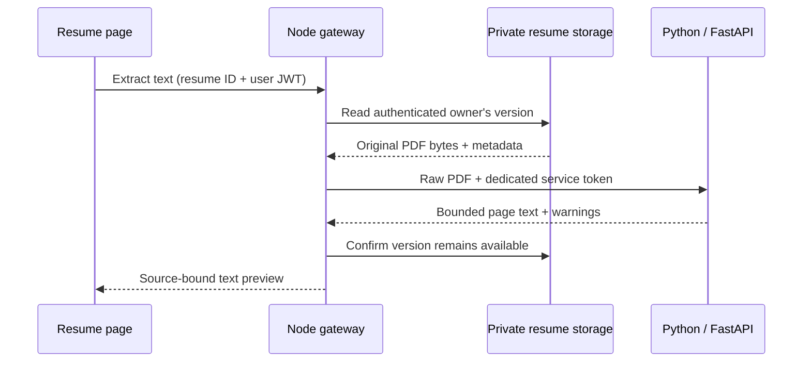

# ADR-010: Private resume text extraction through a Python service

Status: Accepted and implemented for the first Phase 2 batch. Date: 2026-10-02.

## Context

Phase 1 stores private PDF versions but performs no parsing. Phase 2 starts with resume intelligence, followed by JD analysis, matching and Cady. Node owns source data/authentication; Python owns computation and derived intelligence. A small extraction slice establishes that boundary before structured analysis or model calls.

## Decision

- Add `backend/intelligence/` as a Python/FastAPI service. Use pypdf for local text-PDF extraction, with fontTools for embedded CFF Type1 font encodings. Node remains the only browser entry point and performs existing JWT/owner checks.
- Node pushes the owned bytes to a fixed configured internal URL. Python does not download caller-supplied URLs, read Node's MongoDB or mount original resume storage. It does not need the user JWT or CareerOS signing secret.
- Use a separate random `INTELLIGENCE_SERVICE_TOKEN` for Node → Python requests. Reject missing/incorrect credentials before reading the document. Keep the token in ignored server configuration; never expose it through `VITE_*`, URLs or logs. Docker uses private service networking; a host-development listener binds only to loopback.
- Expose the browser contracts under `/api/v1/intelligence`; keep the parser under `/internal/v1`. Forward request IDs and return the existing safe Node error envelope.
- Batch 1 returns page text and source metadata only, with no database writes. Closing the preview discards it. No model calls, OCR or automatic profile updates are part of this batch.
- Durable structured analysis later belongs to Python-owned PostgreSQL. Node continues to own authoritative profile/resume data. pgvector, queues and Kafka are introduced only for their later concrete use cases.

## Initial processing bounds

These are initial implementation limits, to be verified against fixtures and adjusted with evidence.

| Resource | Limit / behavior |
| --- | --- |
| PDF input | 5 MiB, matching the existing upload limit; enforce actual streamed bytes, not just Content-Length |
| Pages | At most 50; reject excess rather than returning an unlabelled partial extraction |
| Extracted text | At most 200,000 Unicode characters including page separators; reject excess |
| Serialized parser response | At most 2 MiB, enforced while reading in both services |
| Parser runtime | 10 seconds in a disposable subprocess; kill and reap on timeout/cancellation |
| Node upstream budget | 15 seconds; abort and return a safe timeout error |
| Parser concurrency | One active extraction per Python instance, with no unbounded queue; return busy for concurrent work |
| Memory | Linux Docker target: 256 MiB child address-space cap and 512 MiB container memory cap; fail readiness if required worker limits cannot be enforced |
| User requests | Initial Node limit: 10 extraction attempts per authenticated user per 15 minutes |

An HTTP timeout alone does not terminate parsing. Use a subprocess without shell interpolation, bounded output and an explicit cleanup path. pypdf documents that compressed content streams can consume substantial memory during parsing; a byte/page cap alone is insufficient. Run the supported parser environment in Linux Docker so memory-limit behavior is reproducible; host-only parsing is optional until equivalent enforcement is verified.

Encrypted PDFs require a separate supported flow and are rejected initially. A valid PDF without extractable text returns `no_text` and a warning; it may be scanned or blank, so do not assert that OCR will always solve it. Complex layouts may have imperfect reading order. Known nonzero xref indexing and extra object-header whitespace may be corrected and reported as one fixed `PDF_STRUCTURE_REPAIRED` preview warning. Match only pinned pypdf module/message templates, never formatted document values. A failed page does not silently produce a supposedly complete result: skipped/damaged content and unclassified warnings reject extraction. Library decompression limits also return a bounded failure.

## Consequences

The existing Node/API/MongoDB stack remains usable if Python is disabled or down. Extraction receives a feature-specific unavailable error. The original PDF remains authoritative and downloadable. Node validates Python's schema and rechecks that the source version has not been deleted before sending the preview. Resume/JD text is untrusted data, never executable HTML or assistant instructions.

This slice incurs another local service and a small worker startup cost. It avoids persistent-analysis lifecycle and model-provider dependencies until the next milestone. It does not claim perfect PDF reading order, scanned-document support or production-scale scheduling. See the [backlog](../phase-2-backlog.md) and [API contract](../api/intelligence.md).

## References

- [pypdf text extraction and limitations](https://pypdf.readthedocs.io/en/stable/user/extract-text.html)
- [Python async subprocess management](https://docs.python.org/3/library/asyncio-subprocess.html)
- [Python resource limits](https://docs.python.org/3/library/resource.html)
- [Docker Compose memory limit](https://docs.docker.com/reference/compose-file/services/#mem_limit)
