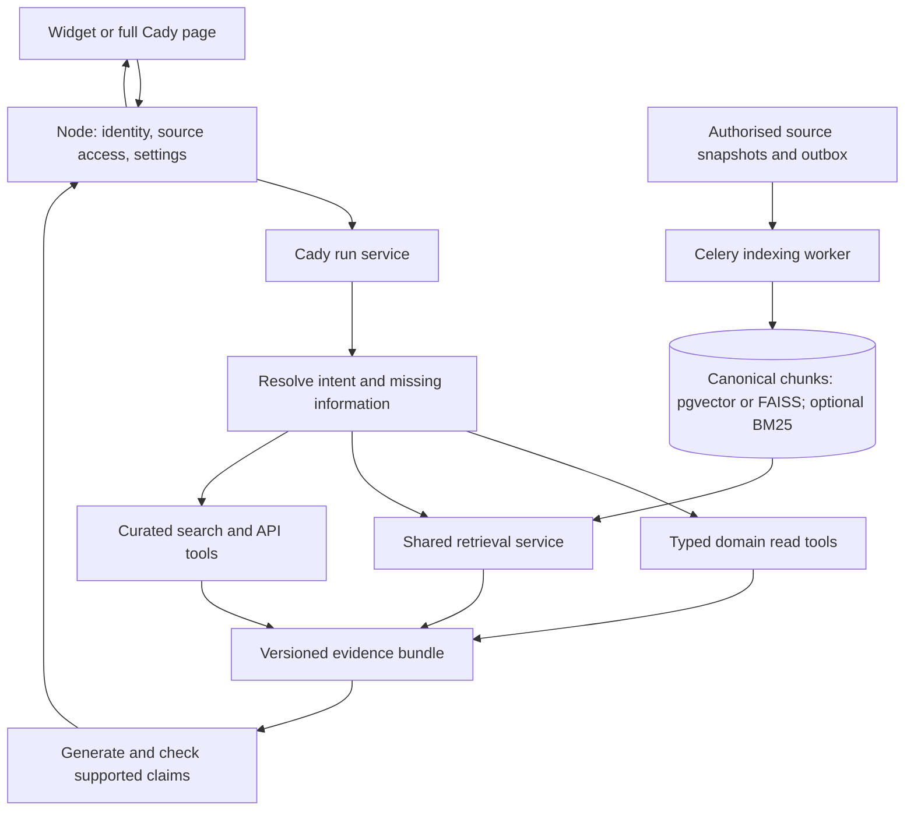

# Cady — retrieval, memory and tool design

Status: **Proposed design, 2026-10-08 IST; implementation not started.** Companion to the [intelligence expansion plan](intelligence-evolution-plan.md). The user confirmed the corpus/memory/action direction and extended the tool design on 2026-10-08. This document plans those requirements; it enables no external processing. Companion plans cover [four-stage RAG/storage](rag-pipeline-and-storage-plan.md), [usage](ai-usage-and-credits-plan.md) and [future research](graph-memory-and-browser-tools-research.md).

## Architecture and ownership

Keep React → authenticated Node `/api/v1` → private intelligence `/internal/v1`. Node owns accounts, authorization, career profile/preferences, jobs, saved jobs, original resumes and connected-account access. Python owns derived analyses, knowledge indexes, chat/workflow state, provider adapters and AI evaluation. Future Java application/interview data arrives through its APIs when implemented. No Python access to Node's MongoDB, JWT secret or original-file mount is introduced.



Proposed modules under `backend/intelligence/app/`; add each only with its batch:

| Module | OOP responsibility |
| --- | --- |
| `knowledge/` | `KnowledgeIngestionService`, authorized source projections and change transport |
| `rag/chunking/` | `ChunkingService`, complete source units and bounded token windows |
| `rag/indexing/` | `IndexingService`, embeddings, canonical chunks and versioned index publication |
| `rag/retrieval/` | `RetrievalService`, backend adapters, optional BM25 fusion, reranking and evidence |
| `rag/generation/` | `GenerationService`, `ContextAssembler`, evidence/claim validation |
| `embeddings/` | `EmbeddingProvider` interface and OpenAI adapter; model/dimension-aware batching |
| `tools/` | `ToolRegistry`, strict arguments/results, policy enforcement and execution records |
| `integrations/` | Domain API, search/fetch and curated MCP/connector adapters |
| `cloud/` | Cloud provider factory and object-storage services; AWS/S3 first, injected local adapter |
| `cache/` | Owner/revision-bound Redis context/index manifests, async warming and database fallback |
| `conversations/` | Thread/message repository, account context and confirmed-memory service |
| `usage/` | Provider-boundary usage records, rate catalog, cost/budget services and Settings summaries |
| `cady/` | Intent/routing and bounded run orchestration; consumes the shared services |
| `evaluation/` | Reviewed cases, retrieval/claim/tool metrics and regression reports |
| Existing `llm/`, `storage/`, `tasks/` | Provider capabilities, authoritative persistence and durable execution |

Keep controllers and startup wiring thin. Preserve `LLMProvider.generate()` for strict CV/JD/preparation schemas. Add a separate typed tool-call request/result contract and provider capability checks; do not overload analyses with agent messages. Resolve effective model settings server-side, retaining them per run.

## Account context, history and memory

Use three explicit layers:

1. **Account knowledge:** current profile/preferences and authorized documents, jobs and plans, reusable across threads. “Constant context” means a stable account knowledge scope; source revisions still update. It does not mean freeze facts forever or attach every document to every prompt.
2. **Conversation:** owner-scoped threads and append-only messages, with a selected CV/job/task context revision. New conversation creates a thread instead of destroying the old one. Changing model or current page preserves messages.
3. **Memory:** relevant historical passages and separately confirmed facts/goals. Old messages retain authorship, date and source state. Assistant suggestions cannot silently override a current profile or become confirmed experience.

Proposed records: `cady_threads`, `cady_messages`, `cady_context_preferences`, `cady_memories` and `cady_runs`. Message/run IDs deduplicate submissions and preserve concurrent revision checks. Migrate the existing bounded conversation into one legacy thread; already discarded older pairs cannot be reconstructed.

Persist run admission and a canonical request hash before provider work. Bind owner, thread/revision, question, effective settings and source scope; the same request ID with changed input is rejected. Repeating the same request reads its current state or saved result, rather than generating again. Allow one pending turn per thread; other threads still respect the shared generation limit. Use short transactions and renewable execution claims, never a transaction held across network calls. Proposed states: accepted → retrieving → generating → verifying → completed, with failed/cancelled/uncertain outcomes. Persist the attempt before a paid call and store accepted messages/result/run completion together where possible. Interrupted or ambiguous provider completion is uncertain; reload/reconcile, with no automatic paid replay. Source changes can suppress an already produced answer. This is not an exactly-once external-provider guarantee.

Assemble approximately **4,000 tokens of memory/knowledge** from separately bounded parts: stable revisioned profile/CV/preferences, up to the latest six messages, relevant older history, current job/analysis evidence and sliding application activity. System instructions, current question, tool schemas and output/reasoning allowance are additional and count toward the complete request/usage. Use the allocation and application-window proposal in the [context plan](rag-pipeline-and-storage-plan.md#approximately-4000-token-context-bundle). Keep tool records separately; never resend the entire archive. Summaries, if later generated, are derived and versioned, not authoritative. Support paginated history, reopen, rename and explicit removal. Apply the existing trash/retained-archive policy when adding chat deletion; trash/support-only archives are excluded from retrieval and user-visible history.

Source removal suppresses access to chunks, derived memories and dependent answers through current owning-service checks; physical index cleanup/rebuild is asynchronous. Fail closed when current access cannot be verified. Multi-source threads need per-message source dependencies; do not hide unrelated conversations indiscriminately. Enforce current access on citations and thread reads. Historical answers are labelled; erased facts are not recovered through a cached answer, summary, checkpoint or vector.

Proposed public contracts, finalized with their implementation batch:

| Endpoint family | Contract |
| --- | --- |
| `GET/PATCH /api/v1/settings/ai` | Owner preferences and revisioned updates; effective defaults validated against capabilities |
| `GET/POST /api/v1/cady/conversations` | Paginated thread summaries/create; no generation on history reads |
| `GET/PATCH/DELETE /api/v1/cady/conversations/:id` | Owner-scoped paginated messages, metadata/context updates and recovery-compatible removal |
| `POST /api/v1/cady/conversations/:id/messages` | Request ID, expected revision, question and permitted source scope; return existing run/result for duplicate intent |
| `GET /api/v1/intelligence/runs/:id` | Safe stage/status, available result, usage and recovery information |
| Tool-plan/action-confirmation endpoints | Server-stored plan/proposal IDs, scope, revisions and approval; no arbitrary client tool arguments |

Use corresponding service-authenticated private contracts; owner comes from Node, not browser input. Keep old Cady endpoints compatible during migration and explicitly version new answer/evidence shapes. Pydantic remains authoritative; export JSON schemas for Node validation instead of writing competing schemas by hand. General career/research questions can work without a CV; personal claims require accessible evidence and ambiguous source selections require clarification.

## Knowledge ingestion and indexing

Knowledge covers all authorized career-relevant account data: structured CV analyses **with original page evidence**, projects/experience/education, profile/preferences, accessible jobs/company facts/JD analyses, saved-job notes/interest, manual application events/statuses, preparation plans/progress and retained conversations. Provide clear account source controls; confirmed scope never implies access to another owner or recovery archive. Phase 3 application/interview records join through owning APIs when available. Credentials and unrelated account data stay excluded. Public web material is a separate corpus; never publish private passages into it.

Node exposes a service-authenticated, owner-bound projection/source-check API for its data; Python-owned data can use its repositories. First ingestion is an explicit bounded backfill followed by transactional outbox events/reconciliation for changes. Use no synchronous embedding call in profile saves. Kafka is not required here.

Proposed source/chunk fields:

```text
source: owner/scope, sourceType, sourceId, sourceVersion, contentHash,
        visibilityRevision, lifecycle, observedAt, validAt, indexRevision
chunk: sourceRef, section, page/start/end or structuredFieldPath,
       originalEvidence, retrievalText, chunkHash, author/trustKind
embedding: chunkHash, provider, model, dimensions, preprocessingVersion, indexVersion
```

Chunk by complete experience/project/requirement/session units before using bounded token windows for long text. Proposed narrative windows are 300–600 tokens with small overlap; measure against evidence recall. Keep canonical originals separate from cleaned retrieval text so citations can show actual source spans. Do not require LLM enrichment to preserve facts; optional enrichment is versioned and labelled derived. Keep user claims and assistant advice distinguishable.

Persist source snapshots/index intents atomically in the owning service. Celery receives IDs, claims work and resolves trusted stored payloads. Recheck revisions before publishing an index generation; older work cannot reactivate obsolete data. Content hashes avoid re-embedding unchanged chunks. Index state distinguishes queued/indexing/ready/failed/obsolete; publish a coherent generation rather than mixing versions. Embed only authorized minimized text after the stage's data notice. Changing embedding model/dimensions builds a separate index before an atomic switch.

## Retrieval decisions

Use the [four-stage pipeline and backend factories](rag-pipeline-and-storage-plan.md). Offer **pgvector or FAISS**, with optional hybrid lexical search/BM25 and concise Settings info text. Pgvector plus PostgreSQL full-text is the proposed first local delivery; FAISS uses S3 artifacts, Redis manifests/hot context and bounded local RAM. Both use canonical PostgreSQL chunks and current owning-service access checks. Database reads keep cold FAISS queries available without promising equivalent dense search before warming. Login/session restoration queues warm-up without blocking sign-in or making a new LLM call. Verify an extension-capable image compatible with current PostgreSQL 17.11 and migration/volume preservation when implementing; no image is changed now. Exact vector search is the first option for small private collections. HNSW comes after measured scale/recall requirements. Hybrid fusion/reranking and filtered approximate-search caveats are documented by [pgvector](https://github.com/pgvector/pgvector#hybrid-search).

For accuracy evaluation, propose OpenAI `text-embedding-3-large`, compared with `text-embedding-3-small` on CareerOS cases. Generation model and embedding model are independent settings. The large model defaults to 3,072 dimensions; pgvector's HNSW `vector` limit is 2,000, so **do not blindly create a 3,072-dimensional vector HNSW index**. Compare reduced dimensions (e.g. 1,536 via API), exact full-dimension search, or a supported `halfvec` index before choosing. Keep model/dimension identity in every index and query. These constraints follow the official [embedding guide](https://developers.openai.com/api/docs/guides/embeddings) and [pgvector index types](https://github.com/pgvector/pgvector#hnsw); quality/access and cost remain to be measured with separately authorized calls.

Per question:

1. Resolve intent and references. Ask when “my resume” or “that job” is ambiguous. Exact status/count/version/date/score questions use structured API/repository reads; vectors and the LLM do not calculate authoritative scores.
2. Establish authorized active source IDs, owner/scope and version filters **before** candidate retrieval. A final post-filter alone is insufficient. For Node-owned sources, batch-check current visibility/revisions; stale index state is not access.
3. For semantic questions, retrieve lexical and dense candidates independently, preserving literal technologies/negations. Fuse ranks and deduplicate. Proposed initial bounds: top 30 from each enabled path, rerank at most 20, consider 6–10 passages and fit selected excerpts within the shared ~4,000-token context budget. Preserve limited adjacent evidence and source diversity. Tune rather than claiming these are optimal. Multi-part questions may use bounded decomposition.
4. Evaluate a local cross-encoder reranker against a bounded model reranker; provider choice and resource limits are settled before installation/calls. Low support triggers one targeted expansion/retrieval repair, then clarification/abstention.
5. Recheck selected sources, build exact evidence references, and generate a bounded answer. Recheck access/currentness before delivering/saving it.

Apply predicates in both lexical and vector queries. HNSW filtering can reduce recall despite correctly filtering returned rows; use measured iterative scans, partitioning or exact fallback, following [pgvector filtering](https://github.com/pgvector/pgvector#filtering). Cached retrieval/answers include owner, source visibility/version, index, question, context and settings versions. Revocation invalidates them. Failed/unavailable embeddings yield labelled lexical/structured retrieval, not silent model memory.

## Evidence and answer accuracy

Use a proposed `EvidenceBundle` with exact quotes, source identity/version/locator, origin URL when public, author/trust type, freshness and access state. Separate documented facts, user-reported facts, historical statements, calculated results, inferences and advice in answer metadata. New current sources outrank older advice; contradictory documents require an explanation or user choice, not silent merging.

Every personal/company/job factual claim must map to supporting evidence or be explicitly unknown. Validate source ID, quote/span integrity, lifecycle, deterministic numbers and allowed links in code. Evaluate an independent verifier for semantic support and contradictory claims on complex answers; it can help but cannot prove truth. A citation that exists but does not support the sentence must fail review.

Repair a known evidence mismatch at most once within the run budget; otherwise remove/qualify the unsupported claim or ask for missing information. Never fabricate projects, qualifications, work authorization, resource URLs or completed actions. Rendering should expose compact sources with page/section/version and clickable public references. Evaluation must inspect actual claims, not only valid JSON.

## Tools, APIs, plugins and webhooks

### Tools are capabilities, not copies of feature pages

A tool is a named, typed operation Cady can request from the application: observe live state, assess it, propose a plan or make an approved change. A feature can use several tools and a tool can support several features. Do not wrap every existing function or screen as an LLM tool. Expose the smallest useful domain capabilities with bounded results, then let Cady choose which facts/actions the question needs.

| Category | Examples | Result and permission |
| --- | --- | --- |
| **Read tools** — get/search | `get_recommendation_context`, `get_user_profile`, `search_jobs`, `get_job_context`, `get_readiness`, `get_interview_history`, `get_application_status` | Current authorized facts, gaps/unknowns, provenance and trusted CareerOS job links; no domain mutation |
| **Write tools** — save/update/record | `update_profile`, `save_job`, `set_job_interest`, `record_application_status`, `save_prep_plan`, `update_preferences` | Apply a reviewed diff through the owning API; expected revision, idempotency key and execution receipt |
| **Agent/action tools** — planning/assessment/scheduling/report | `assess_cv_job_gaps`, `create_prep_plan`, `plan_practice_schedule`, `build_readiness_report`, `research_learning_resources` | Bounded workflow producing a supported draft/report/proposal; declare all nested reads, AI calls and potential writes |

Category and side effects are separate manifest fields. An Agent/action tool does not get unrestricted write access: schedule persistence/calendar changes are Write effects and need approval. `create_prep_plan` first produces a reviewable draft; `save_prep_plan` accepts it through the domain contract. Exact current matching reports can run without a new LLM call; deeper assessment/generation declares model, data and budget and records every provider attempt. Unimplemented interview/full application/calendar capabilities are unavailable, not simulated successes.

### One aggregate context tool, then targeted drill-down

`RecommendationContextService.get_context(question, source_scope, limits)` composes owning-service projections. Expose it as `get_recommendation_context()`; owner comes from the authenticated run, never a model-supplied user ID. It performs no hidden generation and returns the minimum relevant current state:

```json
{
  "user": {"profile_summary": {}, "preferences": {}},
  "active_job": null,
  "recent_applications": [],
  "skill_gaps": [],
  "interview_history": [],
  "current_goals": [],
  "source_refs": [],
  "snapshot": {"observed_at": "...", "revisions": {}},
  "missing": ["active_job_not_selected"],
  "capabilities": {"interview_history": false}
}
```

This is a proposed result shape, not a populated user record. Empty/unavailable history is distinct from a confirmed absence of interviews. Bind skill gaps to their actual CV/JD/report revisions; keep missing non-skill assessments `needs_review`. Cap counts/token sizes and reuse already verified request context instead of refetching everything. Its selected facts consume the same 4,000-token bundle; the aggregator is not an excuse to inject the entire account. A multi-service snapshot reports component revisions/timestamps, not a fictional global transaction.

Keep lower-level tools for missing/ambiguous facts, a different job or deeper evidence. `search_jobs` returns server-produced CareerOS detail links with verified job IDs; Cady does not invent links from company names. Stable account context and RAG provide relevant background; tools provide fresh structured state/actions.

### Observe → reason → act → observe again

For “I have an interview with Google next week. What should I focus on?”:

1. Show a compact tool plan covering relevant account/job/readiness/history reads and a preparation draft, including any new AI cost. Execute within approved scope.
2. Call `get_recommendation_context()` first. Drill into profile, job, readiness or interview history only for missing relevant evidence; clarify the role/date if ambiguous. Current manual records are not proof of an external interview.
3. Identify the biggest supported gaps and explain uncertainty. Do not invent a “60% system design” allocation from the employer name alone.
4. `create_prep_plan()` proposes sessions/time allocation based on actual gaps, deadline and declared availability. Present evidence and a compact preview.
5. On confirmation, `save_prep_plan()` applies the selected change. Re-read the stored plan/progress and report the verified result with its execution receipt.

Proposed user-facing confirmation policy: one **per-turn tool plan** can authorize bounded model-initiated reads/research/draft work, as requested by the user, rather than a popup for every getter. Every mutation still shows its concrete change and requires explicit confirmation unless that exact change is already approved. Routine context assembly/history reads use the authorized conversation/source scope and introduce no independent app action. Material scope/disclosure/cost changes need a new plan; prior approval never permits arbitrary future actions. Confirmation is server-stored with owner, tool/version, approved arguments/scope, source revisions, expiry and budget. Recheck before execution; a stale proposal must be refreshed. Run state includes awaiting-approval and execution/verification.

Use `RecommendationContextService`, `ToolRegistry`, `ToolPolicyService`, `ToolExecutionService` and a bounded `AgentWorkflowService`. Post-action reads verify the owning service's result; if execution is uncertain, reconcile by receipt instead of repeating a potentially completed write. The LLM decides among approved capabilities; the server controls access, limits and execution.

### Execution and external adapters

The LLM proposes calls; `ToolExecutionService` validates and executes allowed calls. Tool manifests declare strict input/output schemas, category, side effects, ownership scope, data disclosure, credentials, deadline, result limits, freshness, budget and idempotency behavior. Tool names/versions are controlled by the server, not user documents. Results contain source provenance, typed failures and execution IDs. No provider or remote plugin bypasses those checks. Responses function calls require matching call IDs and returned results; preserve this in the separate adapter per [official function-calling guidance](https://developers.openai.com/api/docs/guides/function-calling).

Categories above describe what a tool does. Transport/provider types below are orthogonal; a plugin can expose a Read, Write or Agent/action capability.

| Adapter/surface | First useful capabilities | Execution rule |
| --- | --- | --- |
| Internal reads | Profile/preferences, resume/JD evidence, saved jobs, comparisons, plan/progress, task status | Call owning APIs/repositories; derive owner from authenticated run; preserve exact calculations |
| External research | Official learning resources, employer careers/company facts, public search and bounded page fetch | Configured/curated adapters; verified public provenance, timestamps and labelled uncertainty |
| CareerOS actions | Profile patch, job interest, save/annotate a job, preparation draft/save; full application status after Phase 3 | Reviewed proposal, explicit approval, owning service revision check and execution receipt |
| External actions | Calendar/message/application actions when separately scoped | Explicit integration scopes and review; no email/send/apply capability inferred from read access |
| Plugins/MCP | Curated connectors implementing the same typed capability contracts | Versioned manifest, scoped credentials, schema/result validation and revocation |
| Webhooks | Supported source/account events and task completion notifications | Verify signature/replay window, deduplicate event ID, map owner/source and enqueue bounded work |

Start with direct internal reads and one configured web adapter. OpenAI Responses web search is a candidate behind `SearchProvider`; verify tool support for each configured model. Domain filters can prioritize official sources; preserve returned URL annotations and display clickable citations as required by the [web-search guide](https://developers.openai.com/api/docs/guides/tools-web-search). Search queries should contain public skill/role/company terms, not private CV text, contacts or chat history. For stronger sensitive-data separation, search in a public-query-only provider request and feed the cited results to the private answer request. If hosted search cannot meet the contract, use a search API adapter.

Fetch public pages through an adapter that blocks private/local destinations and rechecks redirects/resolved addresses; bound time, bytes and content types. Keep source URLs separate from model prose. Search snippets are discovery candidates; fetch enough evidence before asserting a resource's relevance. Company reviews are attributed opinions; contact enrichment/LinkedIn require supported provider access, not an assumption that a public page grants integration permission.

Begin with proposed two read/assessment rounds, up to six total calls including one approved mutation and its verification read, and a bounded run deadline; benchmark these limits. The aggregate context tool reduces unnecessary getter chains. Nested workflow calls count against the same tool/provider budgets. Independent reads may run in parallel after authorization. Missing credentials, timeouts and partial results remain visible. Long-running analysis/index/research uses existing task history and Celery; chat reads/answers remain interactive. Streaming status/content can follow the source verification contract; do not stream unsupported factual claims as accepted facts.

Plugins extend adapters and manifests, not executable user prompts. Add curated MCP after direct tools prove useful; inspect tools/scopes and do not pass user tokens indiscriminately. Remote descriptions/pages/webhook payloads are untrusted data, never permission or workflow instructions. See official [MCP tools](https://modelcontextprotocol.io/specification/2025-11-25/server/tools) and [security guidance](https://modelcontextprotocol.io/docs/2025-11-25/tutorials/security/security_best_practices).

Webhooks are event ingestion, not a chat command to run arbitrary tools. Keep webhook verification/domain ownership in the appropriate service. An outbound subscription uses configured destinations, signed event IDs and bounded retry; never include private source content by default. Retry transport only when idempotency/receipt contracts support it. External uncertain actions reconcile state rather than automatically repeating sends/submissions.

## Orchestration and frameworks

Start retrieval and read-only orchestration with ordinary OOP services. Use LangGraph when branches, long-running research, user review or pause/resume become part of a selected workflow; its nodes call the same services. No mandatory LangChain layer or vendor-owned vector/file store is needed for this baseline.

Proposed workflow: resolve → approve bounded tool plan → observe/retrieve/research → assess evidence → draft/generate → verify → respond. For a selected change: propose → await review → recheck → execute → observe result → verified receipt. Store owner-scoped checkpoints/run state privately in PostgreSQL. Celery schedules durable steps; LangGraph coordinates their state. Keep a single run executor and resume authorization checks. Interrupted nodes may rerun, so isolate side effects and enforce idempotency, following [LangGraph interrupts](https://docs.langchain.com/oss/python/langgraph/interrupts).

## Page-aware Smart Cady and rollout

Default-off Smart Cady can combine a minimal authorized page descriptor with recent conversation and retrieved facts while the widget is open. Deterministic suggestions are the initial fallback. For dynamic suggestions, debounce meaningful page/context changes, reuse valid cached suggestions, deduplicate in-flight work, reject stale results and stop when closed. Show higher usage expectations and server-side budgets; do not make a paid call for every render or hidden page change.

Use per-capability rollout flags with existing Cady as fallback. Begin with mocked contract/isolation/restart checks and reviewed evidence cases. Benchmark lexical, hybrid, reranked and verifier variants separately before expanding paid checks. Back up and preserve existing volumes; add migrations and rebuildable indexes, not a destructive database replacement. Model changes index/generation versions, not silently reinterpreted old scores or overwritten historical chats.

Before implementing embeddings, web research, memory extraction or agent actions, give the agreed AI/data/provider/cost notice and settle live verification scope. No embeddings, dependencies, tools, workflow engine or external calls are enabled by this document.

Per-call accounting follows the [shared usage plan](ai-usage-and-credits-plan.md), including verifier/repair/tool-generated calls and failed validation. Public search, isolated browser rendering and future graph memory are assessed separately in the [research note](graph-memory-and-browser-tools-research.md); internal CareerOS control uses owning APIs. Finish the selected expansion and Phase 2 verification, then move to Phase 3; future graph/payment work is not a release gate.
