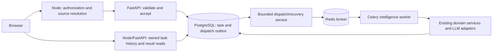

# Intelligence background processing — Celery migration plan

Status: **Planning approved; implementation not started.** Updated 2026-10-08 (IST). The user requested adding Celery to the intelligence direction and identifying current migration candidates. This document enables no worker, broker, schedule, new AI feature or paid verification. Later on 2026-10-07 the user selected preparation/Cady separately; [ADR-017](adr/017-personalized-preparation-and-initial-cady.md) extends the current worker while this executor migration remains planned.

The 2026-10-08 notebook review confirms resume generation is still inline and connects this foundation to the separate [intelligence expansion plan](intelligence-evolution-plan.md). Migrate **existing job and preparation tasks together** before queued resumes; preparation is now implemented, not a future feature. This clarification changes no runtime and does not select implementation.

The latest RAG plan adds durable chunk/index publication, rebuild/invalidation and deduplicated login/session index warming as later consumers of this same execution foundation. See [four-stage RAG and FAISS storage](rag-pipeline-and-storage-plan.md). Broker Redis and context/index cache Redis have different durability/eviction needs; configure them separately when cache warming is introduced. Login never blocks on warm-up or dispatches a new LLM call.

## Direction and current boundary

Use Celery for long-running Python intelligence execution, initially with Redis as its broker. Keep PostgreSQL authoritative for private task status/history, source snapshots and versioned results; use no separate Celery result backend initially. React continues through authenticated Node and private FastAPI APIs. Celery is shared intelligence infrastructure for multiple features, including current preparation and future expensive Cady tools/indexing; it does not own their domain rules or providers. Interactive chat stays outside the default queue.

Today job analyses already have durable PostgreSQL tasks, but execution is a two-second poller started inside FastAPI's lifespan: [worker](../backend/intelligence/app/tasks/service.py#L10), [repository](../backend/intelligence/app/tasks/repository.py#L8), [startup](../backend/intelligence/app/main.py#L50). Resume analysis/extraction still execute inside the HTTP flow. Splitting execution into a worker lets API and task processes restart independently; the migration must preserve existing task IDs, histories, versioning, cancellation and provider-cost controls.

## Migration inventory

| Work | Current implementation | Recommendation |
| --- | --- | --- |
| Job-description AI analysis | `AnalysisTaskWorker` → `JobAnalysisService.analyze`; durable `analysis_tasks` and saved `job_analyses` | **First migration, together with preparation.** Replace the execution poller with Celery delivery; retain existing submission/status/history UI contracts and records. |
| Structured resume AI drafts | [ResumeDraftService.analyze](../backend/intelligence/app/resumes/service.py#L27); extraction then shared LLM, numbered PostgreSQL drafts | **Second migration.** Add a resume task kind and accepted-task UI. Settle private input transport/source rechecks first; no direct original-resume mount or Node MongoDB access. |
| PDF text extraction | [ExtractionService](../backend/intelligence/app/parsing/service.py#L14), bounded disposable parser subprocess | **Keep inline initially.** Current preview is transient and cancellable. A later asynchronous/OCR/bulk workflow can use a separate parser queue, retaining subprocess isolation and explicit retention rules. Celery alone does not fix unreadable PDFs or parser limits. |
| CV-to-job comparison | [MatchingService.compare](../backend/intelligence/app/matching/service.py#L16); deterministic saved-input comparison | **Keep synchronous.** Reconsider only for measured large batch work; no AI call is needed. |
| Resume checks and preparation baseline | [ResumeReviewService.review](../backend/intelligence/app/reviews/service.py#L15); deterministic checks on saved inputs | **Keep synchronous.** Preserve current bounded reports and transient results. |
| Saved-job ranking | [SavedJobRanker](../backend/platform/src/intelligence/ranking.ts#L41); Node orchestrates bounded Python comparisons | **Keep current flow.** A future large batch may delegate Python computations, but Node retains shortlist/preferences and source/revision validation. |
| Task delivery recovery / expired execution leases | Current repository lease recovery happens during `claim()` | **Include in migration.** A small dispatcher/reconciler handles pending delivery and interrupted states without repeating uncertain paid work. |
| Personalized AI preparation | [Implemented](personalized-preparation.md) with the existing durable worker and source-bound PostgreSQL plans | **Migrate alongside job tasks.** Preserve explicit generation, source checks, versioned output and separate review/save contracts; avoid introducing a second executor. |
| OCR, embeddings, indexing and larger AI workflows | Not implemented | **Future candidates.** Separate queues/resources only when the feature and AI/data/cost scope are approved. |
| Cady conversation | Initial bounded read-only assistant implemented; long-running tools remain future | **Keep interactive replies/streaming responsive.** Only explicitly approved long-running tools/workflows become tasks; Celery is not the default path for every chat turn. |
| Remotive/source refreshes, notifications and historical cleanup outboxes | Node scheduler and Node-owned source/outbox records | **Keep in Node.** Python receives authorized domain requests if needed later; do not move ownership or give workers direct MongoDB access. |

## Proposed execution path

1. Validate ownership, source hash, model/options and admission limits before accepting a task. For the job/preparation migration, keep HTTP 202 and existing task IDs.
2. Insert task and dispatch-outbox work in one PostgreSQL transaction. A bounded relay publishes only the task ID, using that ID as the Celery delivery ID. A failed publish leaves an accepted task queued for later delivery; report broker/worker availability separately rather than losing accepted work.
3. The worker resolves the trusted stored payload and atomically claims that specific task ID. Change today's oldest-row `claim()` into a by-ID claim. A repeated Celery ID is not itself deduplication: database state/claims decide whether execution is allowed. Completed/cancelled/failed IDs never generate again.
4. Reuse existing domain services, evidence checks, provider/model adapters and limits. Link each result to its task and atomically store the successful version/task completion in the Python database where possible. Instrument the shared provider boundary through the [usage service](ai-usage-and-credits-plan.md) before validation; attempts, rejected results and unknown usage remain visible.
5. Keep PostgreSQL-backed polling and safe diagnostics. Cancel queued work in the database; delivered cancelled work must exit before calling a provider. Running cancellation remains best-effort and does not promise to stop provider charges.

## Minimal worker design and operating rules

- Keep `app/tasks/repository.py` as the task persistence boundary. Add a small dispatcher adapter, `app/tasks/celery_app.py` for wiring/configuration, `celery_tasks.py` for thin registered wrappers and `runtime.py` for worker lifecycle. Reusable `TaskExecutionService` delegates to existing OOP domain services; do not copy prompts/provider SDK calls into Celery tasks.
- Start with proposed Compose services `intelligence-broker` and `intelligence-worker`, one `intelligence.ai` queue and one prefork worker slot. Preserve the current 20-active-global / two-active-per-owner admission bounds initially; migrate existing tasks/history without dropping PostgreSQL volumes. Do not add Flower, a result backend or multiple queues until needed.
- **Concurrency blocker before cutover:** today's `GenerationGate` is process-local. Worker concurrency one does not serialize it with resume generation still in FastAPI. Introduce a shared generation permit across API/worker processes (proposed PostgreSQL-backed lease) before separating execution. Preserve one generation across consumers; do not multiply provider calls by adding replicas.
- Build async provider clients, PostgreSQL pools and the event loop after worker fork. Own them in one `WorkerRuntime`/event-loop lifecycle per child; do not reuse FastAPI's resources or create fresh loops around persistent async clients. Verify and pin Celery/Redis-client compatibility with the current Python 3.14 Linux image, prefork behavior, container limits and clean shutdown before coding the production adapter. No dependency/runtime version is changed by this plan.
- Keep broker messages JSON and ID-only; private source text stays in the trusted task repository. Use a private broker, authenticated configuration, dedicated namespace/persistence and bounded dispatch. Broker durability is not the sole recovery mechanism: the PostgreSQL dispatch outbox can reconcile missing work.
- Preserve the current 90-second provider deadline and feature input/output bounds. Choose explicit worker soft/hard timeouts, lease/heartbeat and Redis visibility settings together; use prefetch one and test delivery recovery. A Celery time limit does not replace parser memory limits or reliably cancel an external call.
- Set no automatic retry for paid provider failures or uncertain running attempts. Retry only known pre-provider dispatch/availability failures within a bounded policy. Redelivery checks the persisted attempt before execution; interrupted running work becomes failed and users review saved versions before retrying. Retain JD generation's existing validation-recovery attempt; do not add a second Celery retry layer. Do not promise exactly-once external provider execution.
- For queued resume generation, the first proposal is bounded extraction during explicit Analyze intake, then private derived page text/source refs in the task payload. Separate this from transient Extract text. Define intake retention, authorized Node source rechecks before processing, result freshness checks, trash/restore handling and queued cancellation before changing that flow.
- Add Celery Beat only when a periodic intelligence maintenance task needs it, with one scheduler and overlap protection. Existing Node refresh/notification schedules and the requested Codex notebook-review automation stay separate.

These delivery/concurrency precautions follow Celery's documented [task acknowledgement/idempotency behavior](https://docs.celeryq.dev/en/stable/userguide/tasks.html), [Redis redelivery caveats](https://docs.celeryq.dev/en/stable/getting-started/backends-and-brokers/redis.html), [prefork concurrency guidance](https://docs.celeryq.dev/en/stable/userguide/concurrency/index.html) and [single Beat scheduler requirement](https://docs.celeryq.dev/en/stable/userguide/periodic-tasks.html). The queue names, PostgreSQL outbox, shared permit and migration sequence above are CareerOS design proposals, not claims that Celery implements those policies for us.

## Implementation order and acceptance — later authorization required

1. **Foundation:** settle runtime pins, dispatcher/by-ID claim/outbox models and shared generation permit; add private broker/worker configuration and mocks.
2. **Job/preparation cutover:** migrate both existing task kinds, stop the old execution poller, preserve histories/API/UI and prove only one executor owns each attempt. Provide a rollback switch that never runs both execution backends concurrently or resets results.
3. **Failure verification:** test duplicate delivery, broker outage/lost publish, API/worker restarts, interrupted provider work, expiry/cancellation, global and per-owner admission, cross-process capacity, owner isolation and source changes. Verify pool/event-loop lifecycle, task-linked version saves and safe diagnostics using mocked providers; no paid live check without explicit authorization.
4. **Resume generation:** add task kind/intake/source-recheck contracts and task history UI; preserve evidence, versions, profile confirmation and retained data. Notify the user before changing AI/data-retention/cancellation behavior.
5. **Future features:** use the same task infrastructure for approved batch analysis, expensive OCR/indexing or Cady research workflows; keep cheap interactive work inline. RAG tasks pass owner/source/index revision IDs, publish coherent generations and reject stale work. Warm-up resolves ready manifests/S3 files without re-embedding; the serving search process also loads its own FAISS index on demand.

First implementation scope should be **Celery foundation + existing job/preparation analysis**. Resume generation and future features remain separate batches. This plan does not authorize implementation, infrastructure startup, tests or external AI calls now.
